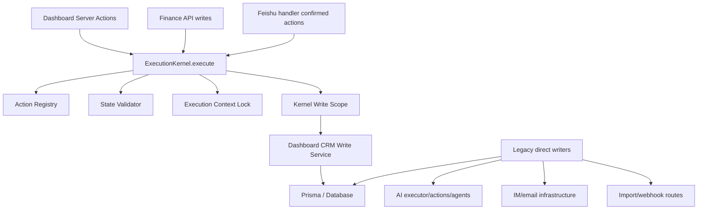

# v2.1.6 System-wide Kernel Closure Report

Date: 2026-06-21

## Actual Architecture After This Pass

## Kernel Closure Implemented

- Added `lib/kernel/system-gate.ts`.
- Added `lib/kernel/action-registry.ts`.
- `ExecutionKernel` now validates every action against the registry before execution.
- `ExecutionKernel` now wraps service execution with a kernel write scope.
- Dashboard CRM write actions are routed through `ExecutionKernel.execute`.
- Finance invoice/payment write APIs are routed through `ExecutionKernel.execute`.
- `SET_PRIMARY_CONTACT` is registered and dispatched through the Kernel service.

## Action Registry Coverage

Registered business action domains:

- Lead
- Customer
- Contact
- Quote
- Order
- Task
- Project
- Product
- Follow-up
- Template
- Calendar
- Document
- Business line
- Sales goal
- Quote item
- Order item
- Customer/order list view
- External source
- Invoice
- Payment
- AI delete action

Unknown action behavior:

- Unregistered action throws `KERNEL_UNKNOWN_ACTION`.

## Write Gate Status

Implemented gate:

- `withKernelWriteScope(actionType, fn)`
- `currentKernelWriteSource()`
- `assertKernelWrite(source)`

Current limitation:

- The Prisma client is not yet globally wrapped to enforce `assertKernelWrite()` on every mutation.
- Therefore, legacy code can still call Prisma writes directly unless detected by audit.

## Dashboard Write Closure

Dashboard server actions routed through Kernel include:

- leads
- customers
- contacts
- quotes
- quote items
- orders
- order items
- tasks
- projects
- products
- follow-ups
- templates
- goals
- calendar
- business lines
- documents
- customer views
- order views
- external sources
- AI analysis delete

Result:

- `app/(dashboard)/**/actions.ts` no longer owns the business write decision path.

## Finance API Closure

Routed through Kernel:

- `POST /api/finance/invoices`
- `PUT /api/finance/invoices/[id]`
- `DELETE /api/finance/invoices/[id]`
- `POST /api/finance/payments`

Read paths remain direct Prisma reads.

## Remaining Direct Write Bypasses

The system-wide audit still fails because direct Prisma writes remain outside Kernel.

Business write bypasses:

- `app/api/webhooks/leads/route.ts`
- `app/api/import/leads/route.ts`
- `app/api/import/customers/route.ts`
- `app/api/import/products/route.ts`
- `lib/domain/auto-tasks.ts`
- `lib/orders/calculator.ts`
- `lib/im/feishu-write-executor.ts`
- `lib/im/feishu-lead-update.ts`
- `lib/ai/executor.ts`
- `lib/ai/actions.ts`
- `lib/ai/crm-analyzer.ts`
- `lib/ai/agents/followup-agent.ts`
- `lib/ai/agents/deal-scoring-agent.ts`

Infrastructure/config write bypasses:

- `lib/email/service.ts`
- `lib/communication/message-service.ts`
- `lib/im/feishu-handler.ts`
- `app/api/im/**`
- `app/api/email/**`
- `app/api/ai-control/**`
- `app/api/ai/config/route.ts`
- `app/api/customer-segments/preferences/route.ts`

## State Machine Closure

Order status validation through Kernel:

- `UPDATE_ORDER`
- `UPDATE_ORDER_STATUS`

Known bypass risk:

- Any remaining direct `prisma.order.update()` can still bypass the state validator.
- Confirmed remaining bypass: `lib/orders/calculator.ts`.

## Source Of Truth Status

Current sources still present:

- Database
- Conversation memory
- Intent store
- Handler-local context
- Legacy AI executor state
- Legacy Feishu write executor state

Conclusion:

- The system is partially Kernel-driven, not fully Kernel-owned.

## v2.2 Readiness

Status: Not ready.

Reasons:

- Direct business writes still exist outside `ExecutionKernel.execute`.
- The Prisma mutation gate exists but is not globally enforced.
- AI and Feishu legacy executors still contain independent business execution paths.
- State transitions can still be bypassed by direct writes.

## Required Before v2.2

- Move `lib/im/feishu-write-executor.ts` business writes behind Kernel.
- Move `lib/ai/executor.ts` and AI business actions behind Kernel.
- Move import/webhook business creation routes behind Kernel.
- Add a Prisma-level mutation guard or a repository wrapper that calls `assertKernelWrite`.
- Keep infrastructure writes either explicitly excluded or routed through a separate infrastructure kernel.
